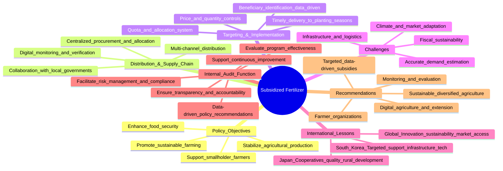

# Global Undernourishment Explorer: Indonesia & Beyond

## About Me

Hi, I'm an internal auditor with 16 years of experience auditing local governments across Indonesia. My work has exposed me to the persistent challenges of stunting, the struggles of Indonesian farmers, and the critical need for data-driven analysis in policy making. This project is a personal initiative to bring together rigorous data, economic insights, and practical policy perspectives to address food security and agricultural reform in Indonesia.

## Project Overview

This Streamlit app provides an interactive dashboard to explore the prevalence of undernourishment (PoU) across selected countries, with a special focus on Indonesia. It highlights the interplay between institutional quality, economic policy, and agricultural interventions—especially fertilizer subsidies—drawing lessons from international best practices.

**Keywords:**
- Food Security
- Agrarian Reform
- Fertilizer Subsidy

## Mindmap Summary: Subsidized Fertilizer in Indonesia

The attached mindmap visualizes the complex ecosystem of Indonesia's fertilizer subsidy policy:
- **Market Distortion:** Subsidies can distort price signals, leading to inefficiencies and overuse. There are risks of mismatch between government and PT. PI (state fertilizer company) estimates, and incentives for PT. PI to prefer imports over local production.
- **Distribution Challenges:** The supply chain is complicated by regulatory, logistical, and data issues. Ensuring timely and targeted delivery to farmers remains a challenge, with risks of fraud and inefficiency.
- **Risks:** Budget constraints, unreliable demand estimates, and policy misalignment can undermine the effectiveness of subsidies.
- **Recommendations:** Move towards targeted, data-driven subsidies; invest in infrastructure and farmer education; and strengthen monitoring and evaluation.

## Visual Mindmap (with Internal Audit Function)

```
SUBSIDI FERTILIZER
│
├── Policy Objectives
│   ├─ Support smallholder farmers
│   ├─ Enhance food security
│   ├─ Stabilize agricultural production
│   └─ Promote sustainable farming practices
│
├── Distribution & Supply Chain
│   ├─ Centralized procurement and allocation
│   ├─ Multi-channel distribution
│   ├─ Digital monitoring and verification
│   └─ Collaboration with local governments
│
├── Targeting & Implementation
│   ├─ Beneficiary identification (data-driven)
│   ├─ Quota and allocation system
│   ├─ Price and quantity controls
│   └─ Timely delivery to planting seasons
│
├── Challenges
│   ├─ Accurate demand estimation
│   ├─ Infrastructure and logistics
│   ├─ Fiscal sustainability
│   └─ Climate and market adaptation
│
├── International Lessons
│   ├─ South Korea: Targeted support, infrastructure, tech
│   ├─ Japan: Cooperatives, quality, rural development
│   └─ Global: Innovation, sustainability, market access
│
├── Internal Audit Function
│   ├─ Ensure transparency & accountability
│   ├─ Data-driven policy recommendations
│   ├─ Evaluate program effectiveness
│   ├─ Facilitate risk management & compliance
│   └─ Support continuous improvement
│
└── Recommendations
    ├─ Targeted, data-driven subsidies
    ├─ Digital agriculture & extension
    ├─ Monitoring & evaluation
    ├─ Farmer organizations
    └─ Sustainable, diversified agriculture
```

## Mermaid Mindmap



## Key Insights (Economics & International Development)

- **Institutional Quality Matters:** Countries with inclusive, stable institutions (Acemoglu & Robinson) achieve better food security outcomes. Indonesia's post-1998 reforms have been pivotal.
- **Policy Consistency Over GDP:** Long-term commitment to social protection and agricultural support is more effective than short-term economic growth alone.
- **Lessons from East Asia:** South Korea and Japan succeeded by shifting from blanket subsidies to targeted support, investing in rural infrastructure, and fostering innovation.
- **Distribution & Market Distortion:** Fertilizer subsidies, if not well-targeted, can create market distortions and inefficiencies, as seen in the Indonesian context.
- **Data-Driven Policy:** Effective food security policy requires robust, granular data—both for targeting interventions and for monitoring outcomes.

## Econometric Approaches

To deepen the analysis, the following econometric methods can be applied:
- **Panel Regression:** To estimate the impact of fertilizer subsidies and institutional reforms on undernourishment rates across countries and over time.
- **Causal Inference:** Using difference-in-differences or instrumental variables to isolate the effect of specific policies (e.g., Indonesia's rice self-sufficiency program).
- **Time Series Analysis:** To forecast trends in food security and evaluate the impact of shocks (e.g., climate events, policy changes).

## Technical Guide: How This App Was Built

- **Data Source:** The app uses FAO's global undernourishment dataset, cleaned and pre-processed in Python.
- **Framework:** Built with Streamlit for interactive visualization and Plotly for dynamic charts.
- **Features:**
  - Country and region comparison of undernourishment trends
  - Narrative and key insights from international organizations and research
  - Special section on Indonesia's fertilizer subsidy policy and lessons from East Asia
  - Expandable sections for in-depth analysis
- **How to Run:**
  1. Clone this repository: `git clone https://github.com/asfalanoij/fao_pou.git`
  2. Install dependencies (preferably in a conda environment): `pip install -r requirements.txt`
  3. Run the app: `streamlit run app.py`

## Inclusivity and Accessibility

This app is designed with inclusivity in mind:
- Uses a colorblind-friendly palette for all charts and visualizations.
- Clear, large fonts and high-contrast backgrounds for readability.
- Key scientific explanations are provided in expandable sections for easy navigation by screen readers.
- <b>Read Aloud</b> button: Users with vision impairment can click the 'Read Aloud' button to have the main summary narrated using their browser's built-in speech synthesis (text-to-speech) feature.

If you have suggestions for further accessibility improvements, please open an issue or pull request!

---

**Let's use data and evidence to drive better policy for Indonesian farmers and the next generation.** 